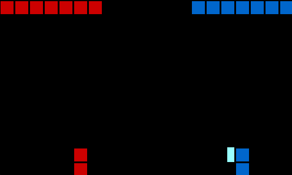

# Minimal Fighting Environment
<p align="center">
  
</p>


This repo contains a minimal implementation of a 1 vs 1 fighting game. The environment uses minimalistic graphics to maximize performance.

## Installation
Simply clone this repo into your working directory, move into the main folder and install with pip

```
git clone https://github.com/fmalato/minimal_fighting_env.git
cd minimal_fighting_env
pip install -e .
```

## Description
The environment uses minimalistic graphics to maximize running and rendering speed. 

Players are represented by stacks of red/blue blocks.
Health bars are shown on the top part of the window using similar blocks.
An attack is shown as a half block. Similarly, a parry is represented by a half block with a lighter shade of red/blue.

There are two attacks ("punch" and "kick") and two parries ("high" and "low"). A "punch" can be blocked by a "high" parry, while a "kick" is prevented using a "low" parry.

### Parameters
- `initial_health`: How many hit points each player has
- `reward_shape`: The reward assigned to a player whenever a certain situation occurs.

### Custom reward
An agent receives a reward in seven different occasions, namely for winning/losing a fight, hitting an opponent and getting hit, blocking/getting stunned, and a time condition. To specify a reward, you have to specify all the conditions. By default, the reward is specified as follows. To use a custom reward, simply change the values related to each condition.
```
reward_shape = {
        "win": 1.0,
        "lose": -1.0,
        "hit": 0.0,
        "hurt": 0.0,
        "block": 0.0,
        "stun": 0.0,
        "time": 0.0
    }
```

## Rules
- Each player has `initial_health` Hit Points.
- If the opponent hits you, you lose 1 Hit Point.
- Successfully blocking an incoming attack stuns the opponent for 
  5 time steps.
- If a stunned player is hit, they are no longer stunned.
- When your Hit Points reach 0, you die.
- Last player standing wins.

## Controls
You can let two agent play, or you can choose to control player 1. In this case, control your agent with the following keys
```
                           [ KEYBOARD ]
--------------------------------------[punch]-----[block high]-----
[move left]----------------------------------- I - O --------------
---- A --- D ---------------------------------- K - L -------------
---------[move right]-------------------[kick]-------[block low]---
-------------------------------------------------------------------
```

## Known problems

## Citation
Coming soon